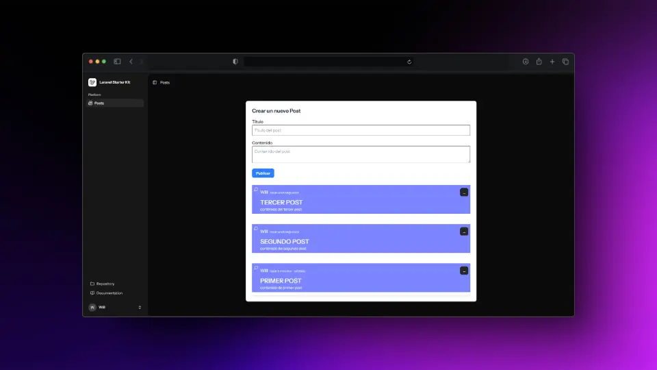

# 📌 Laravel 12 Simple Forum - Sistema de Publicaciones con Notificaciones

Este es un proyecto basado en **Laravel 12** con **Inertia.js**, que permite a los usuarios **registrarse, publicar contenido y recibir notificaciones por correo** cuando se crea un nuevo post. 🚀  

<p align="center">
  
</p>

---
## 🚀 Características  
✔️ **Autenticación y Registro** con verificación de email  
✔️ **Publicaciones (Posts)** con relación a usuarios  
✔️ **Eventos y Listeners** para ejecutar tareas automáticamente  
✔️ **Notificaciones** por correo electrónico cuando se crea un post  
✔️ **Colas (Queues)** para manejar procesos en segundo plano  

---
## Tecnologias

- [Laravel](https://laravel.com/)
- [Inertia.js](https://inertiajs.com/)
- [Tailwind CSS](https://tailwindcss.com/)
- [React](https://reactjs.org/)
- [MySQL](https://www.mysql.com/)
- [Mailhog](https://mailhog.io/)

## 🛠 Instalación  

### 1️⃣ **Clonar el Repositorio**  
```sh
git clone https://github.com/WillJkdev/laravel-simple-post.git
cd laravel-simple-post
```

### 2️⃣ **Instalar Dependencias**
```sh
composer install
npm install
```

### 3️⃣ **Configurar Variables de Entorno**
Copia el archivo `.env.example` y renómbralo a `.env`:
```sh
cp .env.example .env
```
Luego, edita el archivo `.env` y configura:
```env
APP_NAME="Laravel Forum"
APP_URL=http://localhost

DB_DATABASE=laravel
DB_USERNAME=root
DB_PASSWORD=

MAIL_MAILER=smtp
MAIL_HOST=mailhog
MAIL_PORT=1025
MAIL_USERNAME=null
MAIL_PASSWORD=null
MAIL_ENCRYPTION=null
MAIL_FROM_ADDRESS="admin@example.com"
MAIL_FROM_NAME="${APP_NAME}"
```
Si usas Mailtrap, ajusta los valores correspondientes.

### 4️⃣ **Generar la Key de la Aplicación**
```sh
php artisan key:generate
```

### 5️⃣ **Configurar la Base de Datos**
Ejecuta las migraciones para crear las tablas:
```sh
php artisan migrate --seed
```

### 6️⃣ **Levantar el Servidor**
Para correr Laravel:
```sh
php artisan serve
```
Para compilar los assets de frontend (si es necesario):
```sh
npm run dev
```
Tambie puedes usar `composer run dev` para levantar el servidor.

---

## 📌 Funcionalidades Clave  

### 1️⃣ **Autenticación con Verificación de Email**
Laravel ya tiene integrada la verificación de email. Cuando un usuario se registra, se envía un correo con un enlace de confirmación.

📌 Código relevante:
- `RegisteredUserController.php`
- `VerifyEmailController.php`

### 2️⃣ **Creación de Posts**
Los usuarios pueden crear posts. Cada post está relacionado con un usuario.

📌 Código relevante:
- `PostController.php`
- `Post.php` (modelo)

### 3️⃣ **Eventos y Listeners**
Cuando un usuario crea un post, se dispara un evento que ejecuta un listener para enviar correos.

### 4️⃣ **Mensajes Flash con Sonner en Inertia.js**
El sistema muestra mensajes flash usando `Sonner` en el frontend.

📌 Código relevante:
- `FlashMessage.tsx`

Las notificaciones por correo se ejecutan en una cola para no afectar el rendimiento.

---

## 🏗 Estructura del Proyecto  
```plaintext
app/
├── Events/
│   ├── PostCreated.php
│   ├── PostDeleted.php
│   └── PostUpdated.php
├── Http/
│   ├── Controllers/
│   │   ├── Auth/
│   │   │   ├── RegisteredUserController.php
│   │   │   ├── VerifyEmailController.php
│   │   └── PostController.php
├── Listeners/
│   ├── SendPostCreatedNotifications.php
│   ├── SendPostDeletedNotification.php
│   └── SendPostUpdatedNotifications.php
├── Models/
│   ├── Post.php
│   └── User.php
├── Notifications/
│   ├── NewPost.php
│   ├── PostDeletedNotification.php
│   └── PostUpdatedNotification.php
├── Policies/
│   └── PostPolicy.php
└── Providers/
    └── AppServiceProvider.php
```

---

## 🔥 Comandos ÚTiles  

### 🛠 **Reiniciar la base de datos**  
```sh
php artisan migrate:fresh --seed
```

### 📩 **Simular correos con Mailhog**  
```sh
docker run --rm -p 1025:1025 -p 8025:8025 mailhog/mailhog
```
Luego accede a [http://localhost:8025](http://localhost:8025) para ver los correos.


---

## 📜 Licencia  
Este proyecto está bajo la licencia [Licencia MIT](LICENSE). ¡Siéntete libre de modificarlo y mejorarlo! 🚀

---